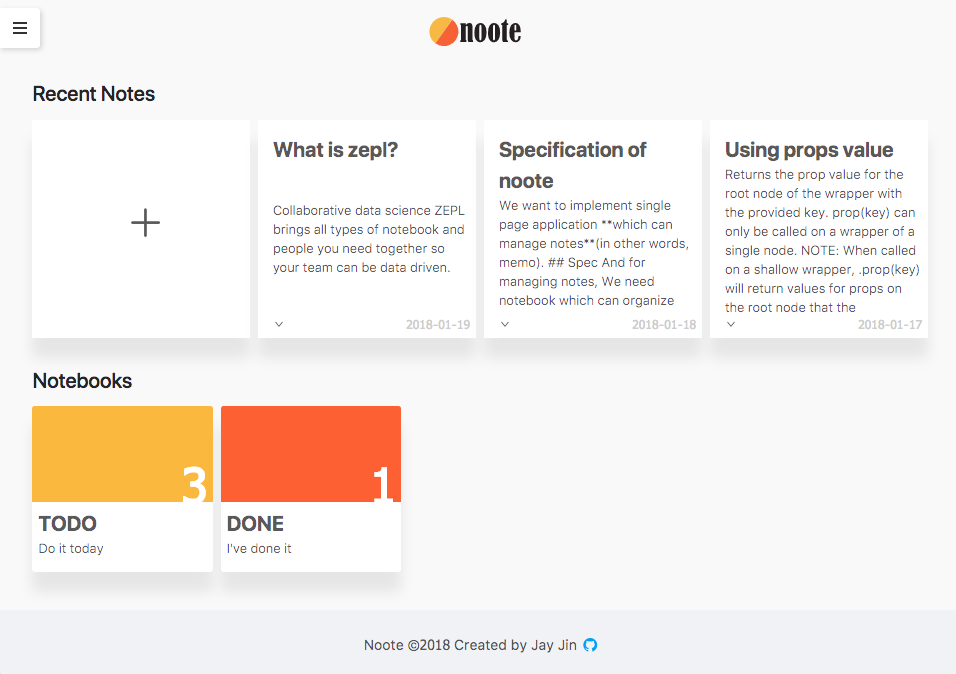

# noote
Simple, lightweight note app with React.


## How to run
It also deployed at [Noote with Firebase](https://nootebook-zepl.firebaseapp.com/).
```
# Run local
$ npm install
$ npm start

# Test
$ npm run test
```

## Issues
Issues are in the [github issue page](https://github.com/milooy/noote/issues/)

## API Specifications
| Method | URI                  | Action name         | Response                                                                                              |
|--------|----------------------|---------------------|-------------------------------------------------------------------------------------------------------|
| GET    | /api/note/           | fetchNoteList       | [{ id: 1, title: "string", date: "date", notebookId: 1, notebookTitle: "string", contents: "string"}] |
| GET    | /api/notebook/       | fetchNotebookList   | [{ id: 1, title: "string", desc: "string", noteIdList: [], color: "string" }]                         |
| GET    | /api/notebook/${id}/ | fetchNotebookDetail | { id: 1, title: "string", desc: "string", noteIdList: [], color: "string" }                           |
| POST   | /api/note/${id}/     | postNote            | "Note no.${id} successfully saved"                                                                    |
| DELETE | /api/note/${id}/     | deleteNote          | "Note no.${id} successfully deleted"                                                                  |
| PUT    | /api/note/${id}/     | moveNote            | "Note was successfully moved"                                                                         |

## Dependencies
- UI library: ant design
- HTTP Client: axios-like custom mocking promise
- CSS Preprocessor: LESS
- WYSIWIG Editor: SimpleMDE
- Hosting: Firebase
- Testing: jest, enzyme
- Other react related library: Redux, redux-promise
